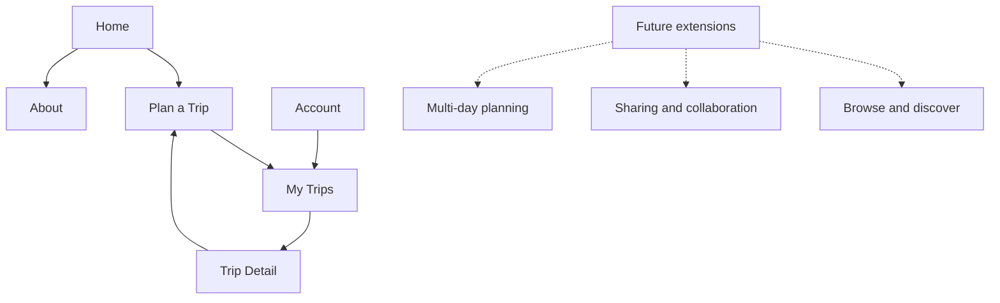

<!-- markdownlint-disable MD013 -->

## Concept Status

These concepts are stakeholder-led design hypotheses. They have not been tested
with prospective users. Concept A was selected as the planner direction on
2026-07-25. Concept B remains documented as an evaluated alternative and a
source of responsive task-state patterns. The concepts translate the
[planning journey](planning-journey.md) and
[current-state audit](current-state-audit.md) into low-fidelity structures that
inform visual styling and implementation architecture.

The concepts preserve the current feature set. Future capabilities influence
room for growth, but no wireframe requires sharing, collaboration, multi-day
planning, rich editorial content, or precomputed detour time.

### Product Language Decision

Use **Jaunt** as the user-facing noun for a saved or in-progress plan. Interface
labels use Plan a Jaunt, My Jaunts, Jaunt name, Save Jaunt, Open Jaunt, and Saved
Jaunt. This language decision was selected on 2026-07-26 for brand personality.

Technical contracts remain unchanged during the spike. Existing `/trips`
routes, `tripId` fields, database tables, API resources, repositories, Redux
state, CSS classes, and file names continue to use `trip` until a production
migration explicitly evaluates their cost and compatibility. General phrases
such as "road-trip planning" may remain when they describe the activity or
market category rather than a JauntDetour object.

A disposable implementation of the selected direction is available in the
[UX redesign prototype](../../spikes/ux-redesign-prototype/README.md). Use it to
review flow and composition; durable decisions remain in this document.

The candidate visual system is documented in
[Brand and UI foundations](../design-system/foundations.md) and rendered in the
[living design-system specimen](../../design-system/specimen/index.html).

## Selected Direction

Use Concept A to organize the planning workspace:

- Keep the map as the persistent spatial anchor
- Place trip-building tools in a stable panel beside or over the map
- Use explicit Build and Discover task views to avoid a long control stack
- Present the same task states as focused sheets or pages on narrow screens

Concept B was not selected because it reduces the map to supporting context for
a task that depends on route position and place location. Both concepts remain
based on the same product shell, routes, terminology, feature-parity scenario,
and responsive component tree.

## Shared Product Shell

### Information Architecture



### Route Model

| Route            | Purpose                                                        | Availability            |
| ---------------- | -------------------------------------------------------------- | ----------------------- |
| `/`              | Branded product introduction with a Plan Your Trip entry point | Public                  |
| `/plan`          | Dedicated new or in-progress planning workspace                | Public                  |
| `/trips`         | Saved trip library                                             | Authentication required |
| `/trips/:tripId` | Saved trip detail and Resume Planning entry                    | Authentication required |
| `/about`         | Product purpose, approach, and support information             | Public                  |
| `/account`       | Account identity and sign-out controls                         | Authentication required |

Authentication should preserve the requested destination. A signed-out user who
opens My Trips or Account is returned there after sign-in. A signed-out user can
still create, modify, and export an unsaved plan.

### Navigation Language

Use plain language for primary navigation. Branded language can add personality
inside the experience without making first-time navigation harder.

| Proposed label | Rationale                                                                    |
| -------------- | ---------------------------------------------------------------------------- |
| Plan a Jaunt   | Selected branded action for starting a route plan                            |
| My Jaunts      | Selected branded destination for saved plans                                 |
| About          | Gives the product story a stable home without crowding the planner           |
| Account menu   | Holds profile identity and sign out without consuming a full navigation item |

Do not expose Detours as a top-level destination yet. Current detours only exist
inside a trip-planning context. A future independent discovery surface could use
Discover after the product supports browsing without an established route.

Use Jaunt consistently in visible product nouns. Pair it with familiar context,
such as Plan a Jaunt and My Jaunts, rather than relying on the word without an
action or destination.

### Desktop Header

```text
+--------------------------------------------------------------------------------+
| JAUNTDETOUR       Plan a Trip   My Trips   About             [Sign in / Avatar] |
+--------------------------------------------------------------------------------+
| Routed page content                                                            |
|                                                                                |
+--------------------------------------------------------------------------------+
```

Header behavior:

- Keep the JauntDetour wordmark and primary navigation persistent
- Mark the active destination with more than color alone
- Make Plan a Trip the strongest navigation action without styling every item
  as a button
- Place sign-in or the account menu at the end of the reading order
- Use a skip link and semantic `header`, `nav`, and `main` landmarks
- Keep the header compact in the planner so the map workspace remains useful

### Narrow-Screen Header

```text
+--------------------------------------+
| JAUNTDETOUR                 [Account] |
+--------------------------------------+
| [Plan]        [My Trips]      [Menu]  |
+--------------------------------------+
| Routed page content                  |
+--------------------------------------+
```

Plan and My Trips remain visible because they are the most common destinations.
About can move into Menu. The same navigation model applies at high text zoom;
the layout may wrap rather than clip labels.

## Shared Home Direction

JauntDetour should have a polished product-introduction home route that is
separate from the planning workspace. Its job is to establish identity, explain
the distinctive value, show the real application, and offer a natural entry
point into planning. It should feel like a focused consumer product page rather
than a generic campaign site or a map with controls layered over it.

Home does not contain route inputs or an interactive map. The Plan Your Trip
action opens an empty planner at `/plan`, where origin, destination, discovery,
itinerary, save, and export interactions begin. Returning users can navigate
directly to Plan or My Trips.

The Roadtrippers reference demonstrates useful product confidence, visible
brand, and clear navigation. JauntDetour should not reproduce its subscription,
review, press, download, or scale claims without equivalent evidence.

### Desktop Home Wireframe

```text
+--------------------------------------------------------------------------------+
| JAUNTDETOUR       Plan a Trip   My Trips   About             [Sign in / Avatar] |
+--------------------------------------------------------------------------------+
|                                                                                |
| Find the stop that                    [Planner screenshot: route + map]          |
| makes the drive.                           [Result-card detail overlay]          |
|                                                                                |
| Discover interesting places along         [Itinerary screenshot crop]          |
| a route you already plan to take.                                             |
|                                                                                |
| [Plan your trip]                                                              |
|                                                                                |
+--------------------------------------------------------------------------------+
| A BETTER WAY TO PLAN THE DRIVE                                                  |
|                                                                                |
| Set the route          Explore the way          Keep the plan                   |
| Start and destination  Search around any point  Save it or open in Google Maps |
+--------------------------------------------------------------------------------+
| HOW IT WORKS                                                                    |
| [Route screenshot] -> [Discovery screenshot] -> [Itinerary screenshot]          |
+--------------------------------------------------------------------------------+
| MADE FOR THE PLANNING MOMENT                                                    |
| Product story, current capabilities, and a second [Plan your trip] action       |
+--------------------------------------------------------------------------------+
| About JauntDetour                                      Privacy  Terms  Contact  |
+--------------------------------------------------------------------------------+
```

The first viewport is one full-width branded composition. Explanatory copy sits
on the left while overlapping product screenshots occupy the right side, but
the hero should not look like two unrelated cards. The screenshots should show
the actual route, discovery, and itinerary experience at a useful scale rather
than decorative browser chrome.

The next section remains partially visible to signal that more content exists.
Plan Your Trip is the only primary hero action and always enters `/plan`; the
home page does not collect partial trip state.

### Mobile Home Wireframe

```text
+--------------------------------------+
| JAUNTDETOUR                 [Account] |
| [Plan]        [My Trips]      [Menu]  |
+--------------------------------------+
| Find the stop that makes the drive.  |
| Discover places worth the detour.    |
|                                      |
| [Route + discovery product visual]   |
|                                      |
| [Plan your trip___________________]  |
+--------------------------------------+
| A better way to plan the drive       |
| Set route -> Explore -> Keep it      |
+--------------------------------------+
| How it works                         |
| [Product screenshot sequence]        |
+--------------------------------------+
```

On narrow screens, the product visual follows the copy instead of shrinking
into an unreadable desktop mockup. The image crop should emphasize one route,
one selected result, and the planning panel. The CTA remains visible in the
first viewport, with a hint of the next section below it.

### Home Content Boundaries

Include in the initial direction:

- Product identity and one clear value proposition
- A single Plan Your Trip action that opens the dedicated planner
- A concise three-part explanation grounded in current features
- Real product screenshots or a short silent demonstration showing route,
  discovery, and itinerary states
- About, privacy, terms, and support destinations as they become available

Do not include without evidence:

- Review counts, trip counts, press logos, or popularity claims
- Subscription trials or mobile app download prompts
- Collaboration, personalized recommendations, or live navigation claims
- A long content funnel that delays access to the planner
- Origin, destination, map, or itinerary controls on the home route

## Concept A: Map-First Workspace

### Map-First Intent

Keep geography continuously visible and make the planning panel a stable tool
surface. This direction best preserves the current product's strongest pattern
while correcting its long control stack and missing shell.

The panel uses internal task views rather than appending every control:

- Build contains route entry, summary, itinerary, save, and export
- Discover contains current category, route-position, radius, and results
- The map reflects selection and itinerary state in both views

My Trips remains a global destination rather than a panel tab. This avoids
mixing the trip library with controls for the active plan.

### Desktop Empty Planner

```text
+--------------------------------------------------------------------------------+
| JAUNTDETOUR       Plan a Trip   My Trips   About                   [Account]     |
+------------------------------+-------------------------------------------------+
| New trip                     |                                                 |
|                              |                                                 |
| Build   Discover             |                  MAP                            |
| -----                        |        Default regional context                 |
|                              |                                                 |
| Where are you headed?        |                                                 |
| Start                        |                                                 |
| [__________________________] |                                                 |
| Destination                  |                                                 |
| [__________________________] |                                                 |
|                              |                                                 |
| [Create route______________] |                                                 |
|                              |                                                 |
| You can plan before signing  |                                                 |
| in. Sign in when you save.   |                                                 |
+------------------------------+-------------------------------------------------+
```

### Desktop Route and Itinerary

```text
+--------------------------------------------------------------------------------+
| JAUNTDETOUR       Plan a Trip   My Trips   About                   [Account]     |
+------------------------------+-------------------------------------------------+
| Carolinas weekend  Unsaved   |                                                 |
|                              |        A Atlanta                                |
| Build   Discover             |         \                                       |
| -----                        |          \                                      |
| Atlanta -> Charlotte         |           route line                            |
| 245 mi  |  3 hr 47 min       |              \                                  |
| [Edit route]                 |               B Charlotte                       |
|                              |                                                 |
| ITINERARY                    |                  MAP                            |
| A  Atlanta, GA               |                                                 |
| |                            |                                                 |
| B  Charlotte, NC             |                                                 |
|                              |                                                 |
| [Find a detour_____________] |                                                 |
|                              |                                                 |
| Trip name [_______________]  |                                                 |
| [Save trip] [Google Maps]    |                                                 |
+------------------------------+-------------------------------------------------+
```

### Desktop Discovery and Results

```text
+--------------------------------------------------------------------------------+
| JAUNTDETOUR       Plan a Trip   My Trips   About                   [Account]     |
+------------------------------+-------------------------------------------------+
| Carolinas weekend  Unsaved   |                                                 |
|                              |       Search area near route midpoint           |
| Build   Discover             |            (radius circle)                      |
|         --------             |                                                 |
| Category                     |      [1] [2] [3] markers                        |
| [Hike v]                     |            \ route                              |
| Route position               |                                                 |
| Start ----o---- End   50%    |                  MAP                            |
| Radius [---o------]  20 km   |                                                 |
| [Search this area__________] |                                                 |
|                              |                                                 |
| 14 results                   |                                                 |
| [1] Paris Mountain           |                                                 |
|     4.7  Hike   [Select]     |                                                 |
| [2] Cedar Falls Park         |                                                 |
|     4.7  Hike   [Select]     |                                                 |
| [3] Fernwood Nature Trail    |                                                 |
|     4.6  Hike   [Select]     |                                                 |
+------------------------------+-------------------------------------------------+
```

Selecting a row persists a selected state and synchronizes a numbered marker.
The current data supports name, category, and rating. The wireframe does not
claim a description, photograph, or added-time preview. The primary action may
read Add to Trip after selection; the interface announces recalculation and
returns focus to a useful itinerary status.

### Desktop Added Detour

```text
+--------------------------------------------------------------------------------+
| JAUNTDETOUR       Plan a Trip   My Trips   About                   [Account]     |
+------------------------------+-------------------------------------------------+
| Carolinas weekend  Unsaved   |                                                 |
| Build   Discover             |        A Atlanta                                |
| -----                        |          \                                      |
| 258 mi  |  4 hr 05 min       |           1 Paris Mountain                     |
| +18 min from original route  |              \                                  |
|                              |               B Charlotte                       |
| ITINERARY                    |                                                 |
| A  Atlanta, GA               |                  MAP                            |
| |  [Move] [Remove]           |                                                 |
| 1  Paris Mountain            |                                                 |
| |  Hike  4.7  +18 min        |                                                 |
| |  [Move] [Remove]           |                                                 |
| B  Charlotte, NC             |                                                 |
|                              |                                                 |
| [Find another detour_______] |                                                 |
| [Save trip] [Google Maps]    |                                                 |
+------------------------------+-------------------------------------------------+
```

### Narrow-Screen Planner

The same Build and Discover views become a full-width sheet over a map. Only one
instance of the planning workflow is rendered.

```text
+--------------------------------------+
| JAUNTDETOUR                 [Account] |
| [Plan]        [My Trips]      [Menu]  |
+--------------------------------------+
|                                      |
|                 MAP                  |
|       route and selected markers     |
|                                      |
+--------------------------------------+
| Carolinas weekend        Unsaved     |
| [Build] [Discover]    [Expand sheet] |
| 245 mi  |  3 hr 47 min              |
| [Find a detour____________________]  |
+--------------------------------------+
```

Expanded Discover state:

```text
+--------------------------------------+
| Discover a detour           [Map]    |
| Category [Hike v]                    |
| Route position                       |
| Start -----o----- End          50%   |
| Radius [----o---------]        20 km |
| [Search this area_________________]  |
|                                      |
| 14 results                           |
| [1] Paris Mountain   4.7  [Select]   |
| [2] Cedar Falls Park 4.7  [Select]   |
| [3] Fernwood Trail   4.6  [Select]   |
+--------------------------------------+
```

At 200% text zoom or short viewport heights, the expanded sheet becomes a
normal scrollable page with an explicit Show Map action. Core tasks never
depend on manipulating the map.

### Map-First Strengths and Risks

Strengths:

- Keeps route geography continuously visible on desktop
- Fits current feature behavior and supports incremental migration
- Separates Build and Discover without creating a long stack
- Makes result-to-marker synchronization prominent
- Feels like a focused planning tool rather than a sequence of forms

Risks:

- First-time users may still need stronger progress cues inside the panel
- A fixed-width panel can become dense as full trip-planning features grow
- Mobile sheets require careful focus, scroll, and map-state management
- Build and Discover labels must clearly communicate that they are task views,
  not separate saved states

## Concept B: Guided Planning Workspace

### Guided Intent

Organize planning as explicit stages: Route, Discover, Itinerary, and Finish.
Each stage receives more horizontal space, while the map becomes a persistent
preview on desktop and an optional context view on narrow screens.

This direction is not a wizard that locks completed steps. Users can move back
and forth without losing state.

### Desktop Route Stage

```text
+--------------------------------------------------------------------------------+
| JAUNTDETOUR       Plan a Trip   My Trips   About                   [Account]     |
+--------------------------------------------------------------------------------+
| New trip                                                                       |
| [1 Route] -------- [2 Discover] -------- [3 Itinerary] -------- [4 Finish]      |
+-------------------------------------------+------------------------------------+
| Where are you headed?                     |                                    |
|                                           |                MAP                 |
| Start                                     |        Default regional context    |
| [Atlanta, GA____________________________] |                                    |
| Destination                               |                                    |
| [Charlotte, NC__________________________] |                                    |
|                                           |                                    |
| [Create route]                            |                                    |
|                                           |                                    |
| Plan now. Sign in only when you save.     |                                    |
+-------------------------------------------+------------------------------------+
```

### Desktop Discover Stage

```text
+--------------------------------------------------------------------------------+
| JAUNTDETOUR       Plan a Trip   My Trips   About                   [Account]     |
+--------------------------------------------------------------------------------+
| Carolinas weekend  Unsaved                                                   |
| [1 Route] -------- [2 Discover] -------- [3 Itinerary] -------- [4 Finish]      |
+-------------------------------------------+------------------------------------+
| Find a worthwhile stop                    | Search area and route              |
|                                           |                                    |
| Category [Hike v]                         |       [1] [2] [3]                  |
| Route position                            |          \ route                   |
| Start --------o-------- End          50%  |                                    |
| Radius [------o-------------]       20 km |                MAP                 |
| [Search this area]                        |                                    |
|                                           |                                    |
| RESULTS                                   |                                    |
| (1) Paris Mountain       4.7  [Select]    |                                    |
| (2) Cedar Falls Park     4.7  [Select]    |                                    |
| (3) Fernwood Trail       4.6  [Select]    |                                    |
|                                           |                                    |
| [Back: Route]                 [Itinerary] |                                    |
+-------------------------------------------+------------------------------------+
```

### Desktop Itinerary Stage

```text
+--------------------------------------------------------------------------------+
| JAUNTDETOUR       Plan a Trip   My Trips   About                   [Account]     |
+--------------------------------------------------------------------------------+
| Carolinas weekend  Unsaved                                                   |
| [1 Route] -------- [2 Discover] -------- [3 Itinerary] -------- [4 Finish]      |
+-------------------------------------------+------------------------------------+
| Your itinerary                            |                                    |
| 258 mi  |  4 hr 05 min  |  +18 min       |       A Atlanta                    |
|                                           |         \                          |
| A  Atlanta, GA                            |          1 Paris Mountain          |
| |                                         |             \                      |
| 1  Paris Mountain                         |              B Charlotte           |
| |  Hike  4.7  +18 min                     |                                    |
| |  [Move] [Remove]                        |                MAP                 |
| B  Charlotte, NC                          |                                    |
|                                           |                                    |
| [Find another detour]                     |                                    |
| [Back: Discover]              [Continue] |                                    |
+-------------------------------------------+------------------------------------+
```

### Desktop Finish Stage

```text
+--------------------------------------------------------------------------------+
| JAUNTDETOUR       Plan a Trip   My Trips   About                   [Account]     |
+--------------------------------------------------------------------------------+
| Carolinas weekend  Unsaved                                                   |
| [1 Route] -------- [2 Discover] -------- [3 Itinerary] -------- [4 Finish]      |
+-------------------------------------------+------------------------------------+
| Keep your plan                            | TRIP SUMMARY                       |
|                                           | Atlanta -> Paris Mountain          |
| Trip name                                 | -> Charlotte                       |
| [Carolinas weekend______________________] |                                    |
|                                           | 258 mi                             |
| [Save trip]                               | 4 hr 05 min                        |
| Sign in is required to save.              | 1 detour                           |
|                                           |                                    |
| [Open in Google Maps]                     | [Compact route preview]            |
|                                           |                                    |
| [Back: Itinerary]                         |                                    |
+-------------------------------------------+------------------------------------+
```

### Narrow-Screen Guided Flow

```text
+--------------------------------------+
| JAUNTDETOUR                 [Account] |
| [Plan]        [My Trips]      [Menu]  |
+--------------------------------------+
| Carolinas weekend        Unsaved     |
| 2 of 4  Discover                    |
| [======--------------]               |
+--------------------------------------+
| Find a worthwhile stop               |
|                                      |
| Category [Hike v]                    |
| Route position                       |
| Start -----o----- End          50%   |
| Radius [----o---------]        20 km |
| [Search this area_________________]  |
|                                      |
| [Show map]                           |
|                                      |
| (1) Paris Mountain  4.7  [Select]    |
| (2) Cedar Falls     4.7  [Select]    |
|                                      |
| [Back]                     [Next]    |
+--------------------------------------+
```

The map opens as a dedicated view or sheet while retaining the selected result
and scroll position. This makes the form and result list primary at narrow
widths without removing spatial context.

### Guided Strengths and Risks

Strengths:

- Makes progress and the current task explicit for a first-time planner
- Gives each task enough space and translates cleanly to narrow screens
- Creates natural extension points for dates, daily stages, lodging, and other
  future full-trip planning capabilities
- Reduces competition between discovery, itinerary, save, and export actions
- Handles accessibility and high text zoom without relying on an overlay panel

Risks:

- Reduces the map's prominence during a spatial discovery task
- Introduces more navigation actions for a short route with one detour
- Can feel like a rigid wizard if completed stages or backtracking are poorly
  handled
- Requires a larger structural migration from the current shell
- May hide cross-stage effects, such as how discovery changes the itinerary,
  unless summary information remains persistent

## Shared My Trips Direction

My Trips is a stable destination in both concepts. It is not a temporary drawer
over the planner.

### Desktop Library

```text
+--------------------------------------------------------------------------------+
| JAUNTDETOUR       Plan a Trip   My Trips   About                   [Account]     |
+--------------------------------------------------------------------------------+
| My Trips                                                       [Plan a trip]    |
| Your saved routes and detours                                                  |
|                                                                                |
| [Carolinas weekend________________]  Atlanta -> Charlotte                       |
| Updated today                         1 detour        [Open] [More]              |
|                                                                                |
| [Mountain coffee run______________]  Asheville -> Knoxville                    |
| Updated Jun 12                       2 detours       [Open] [More]              |
|                                                                                |
| [Previous]                         Page 1 of 2                         [Next]     |
+--------------------------------------------------------------------------------+
```

Current actions remain Open, Duplicate, and Delete. Search, sort, thumbnails,
and folders are future enhancements and should not appear as enabled controls in
the feature-parity concept.

### Empty and Error States

| State               | Primary message               | Action                          |
| ------------------- | ----------------------------- | ------------------------------- |
| Empty               | No saved trips yet            | Plan a Trip                     |
| Loading             | Loading your trips            | None; preserve page structure   |
| Error               | Trips could not be loaded     | Retry                           |
| Delete confirmation | Delete this trip permanently? | Cancel or Delete                |
| Duplicate pending   | Creating a copy               | Disable the affected row action |

## Shared Trip Detail Direction

Trip Detail presents saved data without immediately replacing the active plan.
Resume Planning loads it into `/plan` and makes the loaded-trip update context
explicit.

```text
+--------------------------------------------------------------------------------+
| JAUNTDETOUR       Plan a Trip   My Trips   About                   [Account]     |
+--------------------------------------------------------------------------------+
| < My Trips                                                                     |
| Carolinas weekend                                     [More] [Resume planning] |
| Updated today                                                                  |
+-------------------------------------------+------------------------------------+
| 258 mi  |  4 hr 05 min  |  1 detour      |                                    |
|                                           |                MAP                 |
| A  Atlanta, GA                            |          Saved route preview       |
| 1  Paris Mountain  Hike  4.7  +18 min    |                                    |
| B  Charlotte, NC                          |                                    |
|                                           |                                    |
| [Open in Google Maps]                     |                                    |
+-------------------------------------------+------------------------------------+
```

More contains current Duplicate and Delete actions. Share is not shown until a
sharing capability exists.

## Shared Account Direction

When signed out, the account control opens the sign-in flow. When signed in, it
opens a compact account menu with:

- View Profile
- My Trips
- Sign Out

The menu includes the user's display name and email for identity confirmation.
It supports pointer, touch, keyboard arrow navigation, Home, End, and Escape.

`/account` provides a read-only Account Info view with display name, email,
sign-in provider, saved-trip entry, and sign out. Identity fields are described
as managed by the sign-in provider because the current application does not own
profile editing. Help, support, privacy, data export, notification preferences,
and billing should appear only when those destinations or capabilities exist.

The accepted responsive behavior and viewport matrix are recorded in the
[responsive experience strategy](responsive-strategy.md).

## Feature-Parity Scenario Coverage

| Scenario step                                           | Concept A                                    | Concept B                                                        |
| ------------------------------------------------------- | -------------------------------------------- | ---------------------------------------------------------------- |
| Enter Atlanta and Charlotte                             | Build view beside map                        | Route stage with map preview                                     |
| Confirm distance, duration, and route                   | Persistent Build summary and map             | Route completion summary and persistent stage header             |
| Search for hikes around 50 percent within 20 kilometers | Discover view and map circle                 | Discover stage and map preview                                   |
| Select a result and identify its marker                 | Synchronized row and marker in one workspace | Synchronized row and marker across split stage                   |
| Add the result                                          | Recalculate in place and return to Build     | Recalculate and advance or link to Itinerary                     |
| Remove or reorder the stop                              | Build itinerary tools                        | Itinerary stage tools                                            |
| Name and save while signed out                          | Build save action opens sign-in dialog       | Finish stage opens sign-in dialog                                |
| Load from My Trips                                      | Trip Detail then Resume Planning into Build  | Trip Detail then Resume Planning into Itinerary or Route summary |
| Duplicate or delete a saved trip                        | My Trips or Trip Detail More menu            | Same shared destinations                                         |
| Export to Google Maps                                   | Build action                                 | Finish action and Trip Detail action                             |

Neither concept depends on an unimplemented feature.

## Concept Comparison

Scores range from 1 (weak) to 5 (strong). They express expert judgment against
the current constraints, not user-validation results.

| Criterion                    | Concept A: Map-first | Concept B: Guided | Rationale                                                                    |
| ---------------------------- | -------------------- | ----------------- | ---------------------------------------------------------------------------- |
| First-use clarity            | 4                    | 5                 | Guided stages state the sequence more explicitly                             |
| Spatial discovery            | 5                    | 3                 | Map-first keeps result, marker, route, and radius visible together           |
| Current feature fit          | 5                    | 4                 | Existing behavior maps directly into Build and Discover views                |
| Avoids long control stacks   | 4                    | 5                 | Both improve the stack; guided stages isolate tasks more completely          |
| Narrow-screen coherence      | 4                    | 5                 | Guided pages translate more directly than map sheets                         |
| Keyboard and zoom resilience | 4                    | 5                 | Normal document flow is simpler than maintaining an overlay workspace        |
| Incremental migration        | 5                    | 3                 | Map-first can replace the current sidebar in smaller phases                  |
| Full trip-planning growth    | 3                    | 5                 | Guided stages have more room for dates, days, stays, and complex itineraries |
| Premium product character    | 4                    | 4                 | Either can feel intentional once the shell and visual system are coherent    |
| Feature completion speed     | 5                    | 3                 | Map-first introduces less route and state orchestration initially            |

Unweighted total:

- Concept A: 43 of 50
- Concept B: 42 of 50

The near tie is meaningful. Concept A better serves today's spatial detour task
and migration constraint. Concept B better supports narrow screens and the
long-term ambition to become a comprehensive road-trip planner.

## Selected Recommendation

Adopt **Concept A as the planner structural direction**, with guided task-state
behavior borrowed from Concept B for narrow screens and complex panel states.

The recommended north star is:

- A shared branded shell and product-led home route
- A map-first `/plan` workspace on desktop
- One planning panel with explicit Build and Discover task views
- A focused, guided presentation of those same task views on narrow screens
- Stable `/trips` and `/trips/:tripId` destinations outside the planner
- Visible new, unsaved, saving, saved, and loaded-trip context
- Current controls and current data first, with extension points for richer
  discovery and full trip planning

This is not a third implementation. It is one responsive component and state
model with different spatial composition by available width. Route, discovery,
results, itinerary, and save logic remain shared.

### Why Not a Pure Guided Flow Now

The current distinguishing task is spatial: search at a point along a route,
inspect nearby places, and understand where they sit. Reducing the map to a
secondary preview weakens that task before JauntDetour has the multi-day and
trip-management complexity that would justify a full staged planner.

### Revisit Trigger

Reconsider a predominantly guided workspace when the product adds two or more
of these capabilities:

- Multi-day or multi-leg itinerary structure
- Dates, lodging, or reservation details
- More than one discovery pass with different constraints per route segment
- Collaborative decisions or approvals
- Budgeting or schedule optimization

## Next Design Decisions

With the structural direction selected, proceed in this order:

1. Define the visual and brand direction for adventurous, curated, and premium
2. Define Fluent theme tokens, typography, spacing, elevation, map-marker
   states, and responsive breakpoints
3. Build a component inventory mapped to the selected wireframes
4. Record routing, responsive shell, state, styling, build-tool, and TypeScript
   decisions as short ADRs
5. Convert the selected direction into a phased migration backlog

## Review Questions

- Should the hero show one composed planner screenshot or a short silent
  demonstration assembled from current product states?
- Are Plan a Trip, My Trips, and About the right initial visible destinations?
- Should Build and Discover be named differently while remaining plain-language
  task views?
- Does Trip Detail add enough value before richer trip metadata exists, or
  should My Trips initially open directly into the planner?
- Is map visibility important enough on narrow screens to justify a persistent
  partial map, or is an explicit Show Map action preferable?
- Does the provisional hybrid preserve the product's detour-discovery focus
  while leaving credible room for full road-trip planning?
