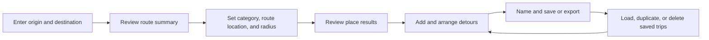

<!-- markdownlint-disable MD013 -->

## Audit Status

This is an expert heuristic audit, not a usability study. JauntDetour does not
currently have user interviews, analytics, or observed usability sessions.
Findings describe risks visible in the implementation and rendered interface;
they do not claim to represent measured user behavior.

The audit supports a feature-parity redesign. It does not require new backend
capabilities or prevent JauntDetour from growing into a full road-trip planning
product. Proposed future capabilities are separated from redesign requirements
so they do not block the initial migration.

### Evidence Labels

- **Repository:** Confirmed in the current source or tests
- **Rendered:** Confirmed by exercising the local application
- **Heuristic:** Expert assessment based on established interaction and
  accessibility principles; requires validation when users become available

## Scope and Method

The audit covered the anonymous planning flow and the source-backed signed-in
trip-management flow.

- Inspected the component tree, Redux state transitions, requesters, tests, and
  responsive styles
- Exercised an Atlanta-to-Charlotte route at 1440 by 900 CSS pixels
- Opened detour search and reviewed returned hiking results
- Inspected the empty mobile shell at 390 by 844 CSS pixels
- Reviewed keyboard and screen-reader semantics through the rendered
  accessibility tree and source
- Compared current behavior with the planning journey in
  [planning-journey.md](planning-journey.md)

Authenticated save and My Trips operations were not executed because doing so
would require an account session and could modify persisted user data. Those
flows were verified through their implementation and tests.

## Current Experience Summary

JauntDetour is a functional map-first planner. An anonymous user can create a
route, search for nearby places at a selected point along it, add and arrange
detours, and export the result to Google Maps. A signed-in user can also name,
save, update, load, duplicate, and delete trips.

The current interface exposes those capabilities as a fixed desktop sidebar or
a separate mobile header and footer menu. The map occupies the remaining
viewport. There is no persistent product identity, global navigation, or
route-addressable destination beyond the single planner.

## Feature Inventory

The redesign must preserve the following current capabilities unless a later
architecture decision explicitly sequences them into a migration phase.

| Area       | Current capability                                          | Anonymous    | Signed in    | Evidence             |
| ---------- | ----------------------------------------------------------- | ------------ | ------------ | -------------------- |
| Route      | Enter textual origin and destination                        | Yes          | Yes          | Repository; Rendered |
| Route      | Clear the current planning state                            | Yes          | Yes          | Repository; Rendered |
| Route      | Display route polyline, distance, and duration              | Yes          | Yes          | Repository; Rendered |
| Discovery  | Select one of eight place categories                        | Yes          | Yes          | Repository; Rendered |
| Discovery  | Select a relative point along the route                     | Yes          | Yes          | Repository; Rendered |
| Discovery  | Select a search radius                                      | Yes          | Yes          | Repository; Rendered |
| Discovery  | Display the search point and radius on the map              | Yes          | Yes          | Repository; Rendered |
| Results    | List place name and Google rating                           | Yes          | Yes          | Repository; Rendered |
| Results    | Highlight a result marker from its list item                | Pointer only | Pointer only | Repository; Rendered |
| Itinerary  | Add a result and recalculate the route                      | Yes          | Yes          | Repository           |
| Itinerary  | Display origin, detours, and destination as a timeline      | Yes          | Yes          | Repository; Rendered |
| Itinerary  | Show added time after a detour is added                     | Yes          | Yes          | Repository           |
| Itinerary  | Reorder or remove detours and recalculate                   | Yes          | Yes          | Repository           |
| Continuity | Preserve in-progress planning state through session storage | Yes          | Yes          | Repository           |
| Save       | Name a trip                                                 | Yes          | Yes          | Repository; Rendered |
| Save       | Prompt for sign-in while preserving save intent             | Prompt only  | Yes          | Repository           |
| Save       | Create a trip or update the currently loaded trip           | No           | Yes          | Repository           |
| Library    | List and paginate saved trips                               | No           | Yes          | Repository           |
| Library    | Load a saved trip into the planner                          | No           | Yes          | Repository           |
| Library    | Duplicate or delete a saved trip                            | No           | Yes          | Repository           |
| Export     | Open the current route in Google Maps                       | Yes          | Yes          | Repository; Rendered |
| Account    | Sign in and sign out through Entra                          | Entry only   | Yes          | Repository; Rendered |

### Current Responsive Model

The interface does not adapt one component tree. It renders separate planning
surfaces and uses CSS to expose the appropriate one.

| Viewport                   | Route entry                                       | Planning content                                       | Map treatment                              |
| -------------------------- | ------------------------------------------------- | ------------------------------------------------------ | ------------------------------------------ |
| Desktop, above 1024 pixels | Fixed left sidebar                                | Sidebar below route entry                              | Remaining viewport to the right            |
| Tablet, 768 to 1024 pixels | No explicit layout rule for the header or sidebar | Neither desktop nor mobile layout is reliably selected | Full viewport with fixed controls possible |
| Mobile, below 768 pixels   | Fixed top header                                  | Collapsible fixed footer menu                          | Viewport between header and footer         |

The breakpoint gap is confirmed in
[App.css](../../frontend/src/styles/App.css): the desktop shell begins at 1025
pixels while the mobile shell ends at 767 pixels. **[Repository]**

## What Works Today

The redesign should retain these strengths.

- The map remains visible while the user builds a trip, preserving geographic
  context **[Rendered; Heuristic]**
- Route entry follows a familiar origin-and-destination model **[Rendered;
  Heuristic]**
- The itinerary presents origin, stops, and destination in travel order
  **[Rendered; Heuristic]**
- Users can plan anonymously and encounter authentication only when saving
  **[Repository; Heuristic]**
- Save intent survives the full-page authentication redirect **[Repository]**
- Export hands navigation to Google Maps instead of recreating turn-by-turn
  guidance **[Repository; Heuristic]**
- My Trips includes loading, empty, error, pagination, duplicate, and confirmed
  delete states **[Repository]**
- Fluent dialogs, drawers, toasts, and inputs establish an accessible component
  foundation for newer features **[Repository; Heuristic]**

## Findings

Severity describes likely impact on completing or understanding the current
task. It is not a measured frequency score.

### High Impact

#### UX-01: The Interface Does Not Establish Product Identity or Purpose

The initial desktop view is a map beside two large inputs and a floating sign-in
button. The mobile view contains the same controls with no JauntDetour name,
orientation, or indication that the product helps discover stops along a route.
The large empty sidebar after the form reinforces the impression of an
unfinished utility. **[Rendered; Heuristic]**

This weakens the adventurous, curated, and premium direction before the user
has taken an action. It also makes JauntDetour difficult to distinguish from a
thin map wrapper.

Redesign requirement: introduce a restrained product identity and a clear
planner entry state without replacing the usable workspace with a marketing
landing page.

#### UX-02: Desktop and Mobile Are Separate Workflows

[Main.jsx](../../frontend/src/components/Main.jsx) mounts `Header`, `Sidebar`,
and `FooterMenu` together. Desktop route entry lives in `Sidebar`; mobile route
entry lives in `Header`; shared itinerary and discovery components are rendered
again in `FooterMenu`. CSS hides surfaces by viewport.

Rendered automation found two origin controls and duplicated result rows in the
document even when one workflow was visually hidden. The component duplication
also explains the large prop surface in `Main`. **[Repository; Rendered]**

This is both a maintenance and experience risk: fixes, semantics, focus, and
state presentation can diverge by viewport.

Redesign requirement: render one responsive planning workflow. Its container
may become a side panel, sheet, or focused screen, but its task state and
component instances should remain shared.

#### UX-03: Route and Discovery Failures Are Silent

[UserInput.jsx](../../frontend/src/components/sidebar/UserInput.jsx),
[DetourForm.jsx](../../frontend/src/components/detour/DetourForm.jsx), and
[DetourOption.jsx](../../frontend/src/components/detour/DetourOption.jsx) log
request failures without presenting an error or recovery action. A route with
no results and a place search with no results also produce no explanatory
state. Route creation, detour search, and route recalculation provide no visible
loading state. **[Repository]**

The user cannot distinguish a slow response, invalid route, empty search, or
service failure.

Redesign requirement: define loading, success, empty, error, and retry states
for route creation, detour search, and every itinerary recalculation.

#### UX-04: Discovery Controls Do Not Communicate Their Values

The Location slider ranges from 1 to 100 and defaults to 50. The Radius slider
ranges from 1 to 100,000 and defaults to 20,000. Neither displays a current
value, endpoint, or unit in the panel. Their visible feedback is a point and
circle on the map. **[Repository; Rendered]**

The labels describe implementation parameters rather than travel decisions.
The user cannot tell whether Radius means distance from the route, added travel
distance, or another constraint.

Redesign requirement: preserve the current percentage and radius capabilities,
but expose their values and units in understandable language. Intent-based
controls such as "around halfway" or an added-time budget remain future
enhancements unless supported by current APIs.

#### UX-05: Results Do Not Support an Informed Comparison

An observed hiking search returned fourteen visible results. Each row contained
only a name, rating, and large plus symbol. The map showed a cluster of similar
markers without persistent labels. Hovering a row highlighted its marker, but
the highlight was unavailable to keyboard and touch input. Adding a result was
the only visible row action. **[Repository; Rendered]**

The current interface supports selection, not comparison. It does not expose
the result's route position or added time until after the user commits to it.

Redesign requirement: improve hierarchy and selection using current data first.
Each row must have a contextual accessible name, a persistent selected state,
and a non-pointer connection to its map marker. Added-time preview, imagery,
descriptions, and richer curation signals should be planned as future data
enhancements rather than assumed by feature-parity wireframes.

### Medium Impact

#### UX-06: The Planning Panel Is a Long Undifferentiated Stack

After a route is created, route actions, trip name, itinerary, Save Trip,
discovery settings, and results all accumulate in one scrollable sidebar.
Opening discovery places its controls below the itinerary and Save Trip action.
Results can push the relevant controls more than a viewport away. **[Rendered;
Heuristic]**

Redesign requirement: organize the same features into explicit task states or
views, with clear access to Build and My Trips. Keep the route summary and
current itinerary available without forcing every control into one scroll.

#### UX-07: Save Context Is Ambiguous After Loading a Trip

[SaveTrip.jsx](../../frontend/src/components/sidebar/SaveTrip.jsx) creates a new
trip when no current trip exists and updates the loaded trip otherwise, but its
button always reads "Save Trip." The planner does not visibly identify whether
the user is editing a saved trip or an unsaved plan. **[Repository]**

Redesign requirement: expose saved, unsaved, saving, saved, and update context.
A future "Save as copy" action may reuse the existing duplicate capability, but
it is not required for the feature-parity concept.

#### UX-08: Added, Available, and Selected Places Are Hard to Distinguish

Available markers and added detour markers use closely related blue colors.
Hover changes an available marker to red, but there is no persistent selected
result state. Marker clusters overlap at the rendered search scale. **[Repository;
Rendered]**

Redesign requirement: use shape, label, state, and color together to distinguish
search area, available result, selected result, and itinerary stop. The list
must remain a complete alternative to map interaction.

#### UX-09: Several Core Controls Have Incomplete Accessible Names

Origin and destination rely on placeholder text instead of persistent labels.
Location and Radius headings are not programmatically associated with their
range inputs. Result buttons are announced only as "+" and share the literal
ID `{this.name}-detour-button`. The footer toggle has an icon but no accessible
name. **[Repository; Rendered]**

Redesign requirement: every field needs a persistent programmatic label, every
icon action needs a contextual accessible name, and dynamic status must be
announced without relying on map vision.

#### UX-10: Mobile Controls Compete for Limited Space

At 390 pixels wide, the sign-in button overlays the upper-right portion of the
route-entry region. The fixed header consumes 135 pixels and the footer opener
is a full-width blue strip containing an unlabeled chevron. The map remains
usable, but route summary and planning state are hidden until the footer is
expanded. **[Rendered; Heuristic]**

Redesign requirement: keep desktop as the primary planning target while
providing one coherent narrow-screen flow. Account actions must not overlap
route entry, and the collapsed planning surface must identify its purpose and
current state.

#### UX-11: Destructive and Recalculating Actions Need Better Feedback

Removing a detour immediately recalculates the route with no confirmation or
undo. Reorder and add actions also recalculate without an in-context pending
state. Saved-trip deletion does use a confirmation dialog. **[Repository]**

Redesign requirement: show which itinerary item is changing, prevent repeated
actions during recalculation, announce the result, and provide recovery for
accidental removal. This can be solved in the client interaction model without
new backend capability.

### Lower Impact

#### UX-12: Visual Language Is Inconsistent

The planning workflow combines Bootstrap-like grid and button classes, global
pill-button overrides, custom timeline cards, Font Awesome icons, Fluent 2
dialogs and drawers, and Google Maps controls. Blue, green, red, teal, and
category-specific colors do not derive from a documented token system.
Typography is largely inherited. **[Repository; Rendered]**

Redesign requirement: use Fluent 2 for interaction primitives, define a compact
JauntDetour theme layer, and retire legacy visual rules incrementally. Google
Maps remains an embedded visual system and should be treated as an intentional
part of the composition.

#### UX-13: The Shell Has No Stable Navigation Model

My Trips and account controls float above the map, while planning is implicit in
the page itself. The My Trips drawer overlays the same map workspace and can
remain open after loading a trip. There is no route-addressable trip detail or
account destination. **[Repository; Heuristic]**

Redesign requirement: introduce a small application shell with Plan, My Trips,
and Account destinations. A trip detail route can initially present current
saved data and a Resume Planning action; sharing remains a future extension.

## Feature-Parity Redesign Contract

The first concept should satisfy every P0 item. P1 items may be sequenced during
migration, but the north-star design must show where they belong.

| Priority | Requirement                                 | Acceptance signal                                                                                                                |
| -------- | ------------------------------------------- | -------------------------------------------------------------------------------------------------------------------------------- |
| P0       | One responsive planner component tree       | Route, discovery, itinerary, save, and export use shared components across viewports                                             |
| P0       | Preserve the anonymous planning path        | A signed-out user can build, modify, and export a route before authentication                                                    |
| P0       | Preserve all current discovery controls     | Category, relative route location, and radius remain available with visible values and units                                     |
| P0       | Preserve itinerary editing                  | Added stops can be viewed, reordered, and removed with route recalculation feedback                                              |
| P0       | Preserve save and authentication continuity | Save prompts for sign-in when needed and resumes after redirect without losing work                                              |
| P0       | Preserve My Trips operations                | List, paginate, load, duplicate, and confirmed delete remain represented                                                         |
| P0       | Preserve Google Maps export                 | The completed itinerary can open in Google Maps                                                                                  |
| P0       | Define complete async states                | Route, search, recalculate, save, load, duplicate, and delete have pending, success, empty, and error treatment where applicable |
| P0       | Meet WCAG 2.2 AA interaction fundamentals   | Persistent labels, keyboard access, visible focus, announced changes, 200% zoom support, and non-map alternatives are specified  |
| P1       | Clarify planner state                       | The shell identifies new, unsaved, saving, saved, and loaded-trip states                                                         |
| P1       | Connect results and map accessibly          | Selecting a result synchronizes list and map without requiring hover or direct map manipulation                                  |
| P1       | Establish stable destinations               | Plan, My Trips, trip detail, and Account have defined navigation and URL behavior                                                |
| P1       | Establish JauntDetour identity              | Brand name, theme tokens, and product purpose are visible without displacing the planning workspace                              |
| P1       | Reduce result overload                      | Results have a legible hierarchy, selection state, and progressive detail using currently available fields                       |

## Future-Compatible, Not Blocking

These capabilities may influence component boundaries and navigation, but
feature-parity concepts must not depend on them.

| Future capability                           | Design accommodation now                                              | Do not assume now                                          |
| ------------------------------------------- | --------------------------------------------------------------------- | ---------------------------------------------------------- |
| Full multi-day road-trip planning           | Allow itinerary and trip detail to grow beyond a single route segment | Dates, lodging, budgets, day grouping, or reservation data |
| Added-time search budget                    | Reserve space for a human-readable detour constraint                  | Precomputed time impact for every result                   |
| Halfway, meal-time, or contextual discovery | Keep discovery criteria extensible                                    | New ranking or recommendation APIs                         |
| Rich curation                               | Support richer result-card content regions                            | Editorial copy, imagery, tags, or proprietary scores       |
| Collaboration                               | Keep trip ownership actions extensible                                | Sharing, co-editing, comments, or voting                   |
| On-road use                                 | Avoid desktop-only data structures and pointer interactions           | Turn-by-turn navigation or driver interaction              |

## Recommended Concept Criteria

The next artifact should compare a map-first workspace and a guided planning
workspace using the same current-feature scenario.

1. Enter Atlanta and Charlotte and confirm the route.
2. Search for hikes near the midpoint within the current radius model.
3. Select a result, connect it to the map, and add it to the itinerary.
4. Review the revised route and remove or reorder the stop.
5. Name and save the trip, including the signed-out prompt.
6. Load the trip from My Trips and make the loaded state explicit.
7. Export the itinerary to Google Maps.
8. Repeat the flow at desktop and narrow-screen widths using the same task
   structure.

Evaluate each concept against these questions:

- Can a first-time visitor understand JauntDetour's purpose before entering a
  route?
- Does the map support the decision without becoming the only way to complete
  it?
- Is the current task, trip state, and primary action apparent at each step?
- Can current features fit without a long undifferentiated control stack?
- Can the structure expand toward full road-trip planning without exposing
  unbuilt features?
- Does the concept remain coherent with keyboard use, 200% zoom, and a narrow
  viewport?

## Audit Limitations

- No finding has been validated with prospective users
- No authenticated screen was exercised with persisted personal data
- No formal automated accessibility scanner or assistive-technology session was
  run
- No browser or device matrix was tested
- Visual contrast ratios were not measured in this pass
- Competitive products were not audited in this pass

These limitations do not block low-fidelity concept work. They should remain
visible when the team evaluates confidence in the final north-star direction.
