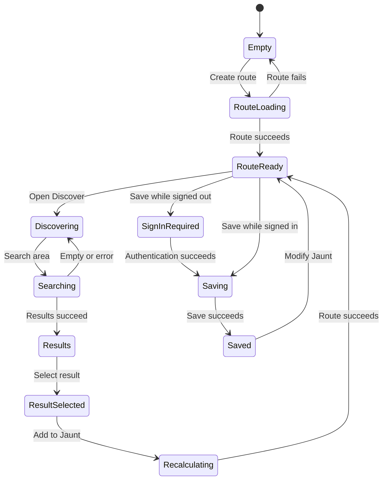

<!-- markdownlint-disable MD013 -->

## Handoff Status

The design spike is **ready for phased development**. The accepted direction is
a branded consumer application with a public Home route and a dedicated
map-first planning workspace. Development should evolve the current React
application incrementally. A greenfield rewrite is not recommended.

The prototype is a behavioral and visual reference, not production source code.
Do not copy its static HTML, CSS, JavaScript, Leaflet integration, or mock state
into the application.

## Recommendation

Adopt a strangler migration around the working application:

1. Establish tokens, theme, routing, assets, and the application shell.
2. Place the current planner behind `/plan` without changing backend contracts.
3. Replace one workflow slice at a time with Fluent 2 compositions.
4. Preserve anonymous planning, session continuity, authentication, save/load,
   and Google Maps export throughout migration.
5. Retire legacy CSS, jQuery, duplicate mobile rendering, and class components
   only as their owning slices move.

This approach minimizes regression risk and keeps the existing route and detour
engine available after every phase.

## Source-of-Truth Map

Read these artifacts in order before implementing a frontend slice:

| Priority | Artifact | Owns |
| --- | --- | --- |
| 1 | [Canonical tokens](../../design-system/tokens/jauntdetour.tokens.json) | Color, typography, spacing, radius, size, motion, and responsive values |
| 2 | [Brand and UI foundations](../design-system/foundations.md) | Semantic visual usage and brand rules |
| 3 | [Fluent 2 mapping](../design-system/fluent-token-mapping.md) | Translation into Fluent and React compositions |
| 4 | [Concept directions](concept-directions.md) | Selected information architecture and map-first screen structure |
| 5 | [Responsive strategy](responsive-strategy.md) | Viewport behavior, scroll ownership, and validation matrix |
| 6 | [Current-state audit](current-state-audit.md) | Existing behavior and UX risks |
| 7 | [Planning journey](planning-journey.md) | User job, journey, and accessibility intent |
| 8 | [Clickable prototype](../../spikes/ux-redesign-prototype/README.md) | Accepted flow and composition reference |
| 9 | [Living specimen](../../design-system/specimen/index.html) | Rendered foundations and component direction |
| 10 | [Brand assets](../../design-system/assets/brand/README.md) | Selected mark and favicon/installable-app exports |

When artifacts differ, tokens and written decisions take precedence over
prototype CSS.

## Accepted Product Decisions

### Information Architecture

| Route | User-facing destination | Initial behavior |
| --- | --- | --- |
| `/` | Home | Product introduction and Plan Your Jaunt entry |
| `/plan` | Plan a Jaunt | Map-first Build and Discover workspace |
| `/trips` | My Jaunts | Saved Jaunt library |
| `/trips/:tripId` | Jaunt Detail | Saved route preview and Resume Planning |
| `/about` | About | Product purpose and current capability description |
| `/account` | Account Info | Read-only identity, My Jaunts, and Sign Out |

Use **Jaunt** in visible product language. Preserve `trip`, `tripId`, `/trips`,
database tables, repositories, requesters, and Redux contract names internally
until a separate compatibility decision justifies changing them.

### Planning Workspace

* The map is the persistent spatial anchor.
* One planner component tree renders at all viewport sizes.
* Build owns route entry, route summary, itinerary, save, and export.
* Discover owns category, route position, radius, result selection, and add.
* My Jaunts is a stable route, not a tab or overlay inside the planner.
* Result list and map markers share stable numbers and selection state.
* The list remains a complete alternative to direct map interaction.

### Brand Direction

* Pine-teal `#12664f` is the primary interaction brand.
* Heritage orange `#e36a2e` carries route and discovery.
* Heritage-orange-strong `#b84a18` supports white text and numbered stops.
* Fraunces provides the wordmark and editorial hierarchy.
* DM Sans provides navigation, controls, body text, and route data.
* The Home Plan Your Jaunt command is the approved orange primary-action
  exception. Planner primary commands remain pine.
* The selected mark uses a pine badge, white route and endpoints, and one
  heritage-orange discovery point on the upper-left bend.

## Feature-Parity Contract

The redesign must preserve these implemented behaviors:

* Anonymous route creation and detour planning
* Origin and destination entry and clear action
* Route polyline, distance, and duration
* Detour category, relative route position, and radius criteria
* Search-area visualization and place results
* Add, remove, and reorder detours with route recalculation
* Jaunt name, create, update, save-intent authentication, and save status
* My Jaunts pagination, load, duplicate, and confirmed delete
* Session-storage continuity through authentication redirects
* Google Maps export
* Sign in and sign out through Entra

Do not make feature-parity screens depend on future sharing, collaboration,
multi-day planning, editorial recommendations, or precomputed detour time.

## Component Handoff

| Prototype pattern | Production owner | Fluent foundation | Required states |
| --- | --- | --- | --- |
| Global header | `AppHeader` | `Button`, `Menu`, router links | Signed out, signed in, compact navigation |
| Home hero | `HomePage` | Fluent commands plus custom editorial layout | Loaded media, unavailable media, compact |
| Planner shell | `PlannerWorkspace` | Custom responsive layout | Wide, compact, expanded map |
| Build/Discover | `PlannerTaskTabs` | `TabList`, `Tab` | Disabled Discover, active Build, active Discover |
| Route entry | `RouteForm` | `Field`, `Input`, `Button` | Empty, invalid, loading, ready, error |
| Route summary | `RouteSummary` | Semantic text and custom composition | Original route, changed route, recalculating |
| Detour criteria | `DetourCriteria` | `Field`, `RadioGroup`, `Slider`, `Button` | Defaults, changed, searching, error |
| Detour result | `DetourResult` | Semantic list item and Fluent command | Available, focused, selected, adding, error |
| Itinerary | `JauntItinerary` | Ordered list, Fluent buttons and tooltips | Empty detours, added, reordering, removing |
| Save status | `JauntSaveStatus` | `Badge`, `Dialog`, `Toast`, `Spinner` | Unsaved, saving, saved, dirty, failed |
| My Jaunts | `MyJauntsPage` | Fluent menu, dialog, spinner | Loading, empty, error, paginated |
| Jaunt Detail | `JauntDetailPage` | Fluent commands plus custom map layout | Loading, ready, error |
| Account | `AccountMenu`, `AccountPage` | `Menu`, `MenuItem`, `Button` | Signed out, signed in, signing out |
| Map | `JauntMap` | Google Maps and custom markers | Empty, route, search area, results, selected, stops |

Names are suggested ownership boundaries, not a mandate for a broad rename.

## State and Interaction Requirements

* Every asynchronous transition needs localized pending, success, empty, error,
  and retry behavior where applicable.
* Authentication preserves the requested route and in-progress Jaunt.
* Loading a saved Jaunt makes update context explicit.
* Browser back and forward restore stable route destinations without discarding
  the current plan unexpectedly.
* Focus moves to meaningful status or content after route, search, add, remove,
  save, and dialog transitions.

## Accessibility and Responsive Acceptance

Every implemented slice must satisfy the
[responsive production checks](responsive-strategy.md#production-acceptance-checks)
and these minimums:

* WCAG 2.2 AA contrast using approved token pairings
* Semantic landmarks, headings, fields, lists, menus, and dialogs
* Complete keyboard operation and visible focus
* Announced route, result, recalculation, save, and error changes
* Non-map alternatives for every map state and action
* Functional layout at 200% zoom and 320 CSS pixels
* Touch targets of at least 24 by 24 CSS pixels, normally 40 to 44 pixels
* Reduced-motion support

## Brand Asset Adoption

The source and generated exports live in
[design-system/assets/brand](../../design-system/assets/brand/README.md). The
implementation phase should update `frontend/public`, the manifest, HTML theme
color, and React header in one reviewable change. Do not redraw the mark in each
component.

## First Production Slice

The lowest-risk first vertical slice is:

1. Add the JauntDetour token and Fluent theme modules.
2. Add React Router and the persistent `AppHeader`.
3. Route the current application unchanged to `/plan`.
4. Add the product-led Home route with a Plan Your Jaunt link.
5. Adopt the selected public icon assets.
6. Verify anonymous planning, login redirect, session continuity, and direct
   `/plan` navigation remain functional.

This creates a visible shell and brand foundation without rewriting planner
logic.

## Non-Goals for Initial Migration

* Backend, auth protocol, data-model, or API changes
* Turn-by-turn or on-road navigation
* Sharing or collaboration
* Multi-day scheduling, lodging, budget, or reservation features
* Greenfield frontend replacement
* Simultaneous Vite and TypeScript conversion
* Pixel-for-pixel copying of the static prototype

## Implementation Definition of Done

An implementation slice is complete when:

* It uses canonical tokens and Fluent mappings without feature-level brand hex
  values.
* It preserves all current behavior owned by the replaced slice.
* Legacy code is removed only when no remaining path uses it.
* Focus, loading, empty, error, and responsive states are implemented.
* Frontend tests cover state and user-visible behavior.
* Desktop and compact browser checks pass at the documented viewports.
* Any intentional deviation from the handoff is recorded in the pull request or
  an ADR.
