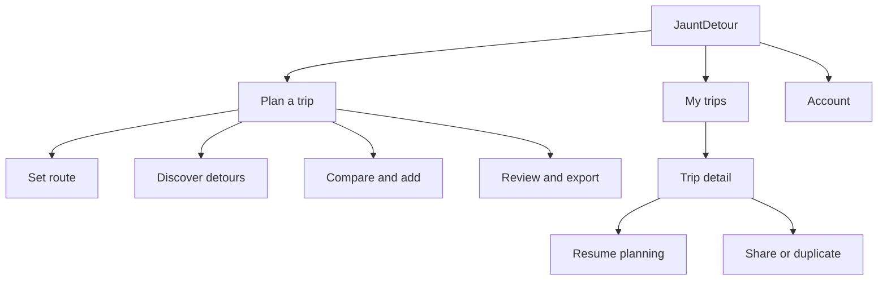

<!-- markdownlint-disable MD013 -->

## Research Status

This journey is a product hypothesis, not validated user research. JauntDetour
does not yet have user interviews, analytics, contextual inquiry, or usability
test results. Use this artifact to guide discovery and low-fidelity design, then
revise it when evidence from prospective users becomes available.

Evidence tags used throughout this document:

- **Observed:** Directly seen in user research or product usage
- **Reported:** Stated by the product owner or another stakeholder
- **Assumed:** A team hypothesis that requires validation with prospective users
- **Repository:** Confirmed by the current application implementation

No product insights are tagged **Observed** in this version.

## Jobs-to-be-Done Analysis

### Primary Job Statement

When I already know where my drive starts and ends but do not know what is worth
stopping for along the way, I want to discover and compare interesting stops
that fit my route, so I can turn the drive into a memorable experience without
adding more time or effort than I am comfortable with. **[Reported]**

### Related Jobs

- Preserve a promising route and its stops so I can return to it later
  **[Reported]**
- Share or shape a trip with other travelers so the plan reflects the group
  **[Reported]**
- Transfer the completed itinerary into Google Maps so I can navigate with a
  familiar mobile tool **[Reported]**
- Feel confident that a suggested stop is genuinely worthwhile before changing
  my route **[Assumed]**

### Current Solution

| Aspect                | Details                                                                                                                               | Evidence                |
| --------------------- | ------------------------------------------------------------------------------------------------------------------------------------- | ----------------------- |
| Current approach      | Build the main route in Google Maps, search along the route, or perform separate searches near towns on the way                       | Reported                |
| Primary pain point    | Finding an unexpected, worthwhile stop requires the traveler to know where to search and combine route and place information manually | Reported and assumed    |
| Existing workaround   | Inspect towns along the route, search each area separately, and add selected places back into the route                               | Reported                |
| Switching cost        | Google Maps is familiar, already available on the traveler's phone, and handles navigation well                                       | Assumed                 |
| JauntDetour advantage | Make route-aware discovery the main task, then hand navigation back to Google Maps                                                    | Reported product intent |

### Desired Progress

The user is not primarily hiring JauntDetour to draw a route. Google Maps already
does that. The distinctive progress is moving from "there might be something
interesting along this drive" to "this stop looks worth an extra 18 minutes,
and I know how it changes my trip." **[Synthesis of reported input; assumed until
validated]**

This makes the detour decision, rather than the map itself, the center of the
experience. A premium experience should make suggestions feel relevant,
explain why each place is worth considering, and expose the travel tradeoff
before the user commits.

### Initial Success Criteria

There is no behavioral baseline. The following measures are proposed for
prototype testing and should not be treated as product targets yet.

| Signal              | Initial hypothesis                                                                                | Research method                     |
| ------------------- | ------------------------------------------------------------------------------------------------- | ----------------------------------- |
| Discovery value     | A participant finds at least one stop they did not already know about and would consider visiting | Moderated task-based usability test |
| Decision confidence | A participant can explain why a stop is appealing and how much time it adds                       | Post-task interview                 |
| Planning effort     | A participant can create a route, assess options, and add a stop without facilitator help         | Usability observation               |
| Differentiation     | A participant can describe a meaningful advantage over using Google Maps alone                    | Comparative concept interview       |
| Continuity          | A participant can save or export the plan and state how they would use it later                   | Prototype test and interview        |

## User Profile Hypothesis

| Attribute              | Current hypothesis                                                                                                   | Evidence                |
| ---------------------- | -------------------------------------------------------------------------------------------------------------------- | ----------------------- |
| User                   | A casual traveler planning a local or regional road trip, potentially for the first time                             | Reported                |
| Goal                   | Find interesting, food, coffee, landmark, or activity stops that fit an already-known drive                          | Reported                |
| Skill level            | Comfortable with Google Maps and general travel websites, but not necessarily a dedicated trip-planning tool         | Reported                |
| Primary device         | Desktop or laptop during focused pre-trip planning                                                                   | Reported                |
| Travel device          | Phone running an exported Google Maps route                                                                          | Reported                |
| Trip pattern           | Initially spontaneous, smaller, and more local than a cross-country itinerary                                        | Reported product intent |
| Accessibility          | No user-specific needs are known; WCAG 2.2 AA should be the baseline                                                 | Assumed requirement     |
| Consequence of failure | The user finds nothing more compelling than results they could find directly in Google Maps and abandons the product | Reported and assumed    |

## Journey Stages

### Stage 1: Recognize an Opportunity

| Dimension     | Journey hypothesis                                                                                       | Evidence             |
| ------------- | -------------------------------------------------------------------------------------------------------- | -------------------- |
| Doing         | Anticipating a drive and wondering whether something interesting lies along the route                    | Reported             |
| Thinking      | "We are already making this drive. Is there anything worth stopping for?"                                | Assumed              |
| Feeling       | Curious, open to spontaneity, but unwilling to spend excessive time researching                          | Assumed              |
| Pain points   | The traveler may not know the names of towns or attractions to search for                                | Reported and assumed |
| Opportunity   | Lead with route-aware discovery rather than asking the user to browse destinations without context       | Synthesis            |
| Accessibility | The entry point and value proposition must remain understandable without relying on map vision or motion | Requirement          |

### Stage 2: Establish the Drive

| Dimension     | Journey hypothesis                                                                                                                 | Evidence             |
| ------------- | ---------------------------------------------------------------------------------------------------------------------------------- | -------------------- |
| Doing         | Entering an origin and destination, reviewing the route, distance, and duration                                                    | Reported; Repository |
| Thinking      | "Is this the route I expect to take?"                                                                                              | Assumed              |
| Feeling       | Task-focused and familiar because the interaction resembles mapping tools                                                          | Assumed              |
| Pain points   | Ambiguous place names, alternate routes, or route errors could undermine trust before discovery begins                             | Assumed              |
| Opportunity   | Confirm the route clearly, preserve typed values, and make correction easy before asking for discovery preferences                 | Synthesis            |
| Accessibility | Inputs need persistent labels, address suggestions must support keyboard use, and route errors must receive focus and be announced | Requirement          |

### Stage 3: Describe a Worthwhile Detour

| Dimension     | Journey hypothesis                                                                                                                                 | Evidence                 |
| ------------- | -------------------------------------------------------------------------------------------------------------------------------------------------- | ------------------------ |
| Doing         | Choosing what sounds appealing, where along the drive to look, and how far they are willing to deviate                                             | Reported; Repository     |
| Thinking      | "I could use coffee around halfway" or "show me something unusual that will not add more than 30 minutes"                                          | Reported and assumed     |
| Feeling       | Curious, but at risk of being burdened by unfamiliar search controls                                                                               | Assumed                  |
| Pain points   | The current location and radius sliders expose search mechanics instead of the traveler's intent                                                   | Repository and synthesis |
| Opportunity   | Ask in travel language: category or mood, approximate timing along the drive, and acceptable added time                                            | Synthesis                |
| Accessibility | Controls need explicit names and values, keyboard operation, non-pointer alternatives, and instructions that do not rely on spatial position alone | Requirement              |

### Stage 4: Compare Discoveries

| Dimension     | Journey hypothesis                                                                                                                                 | Evidence             |
| ------------- | -------------------------------------------------------------------------------------------------------------------------------------------------- | -------------------- |
| Doing         | Scanning suggested places, locating them on the route, and comparing interest against travel cost                                                  | Reported and assumed |
| Thinking      | "Why this place, and is it worth the detour?"                                                                                                      | Assumed              |
| Feeling       | Delighted by an unexpected find or skeptical when results feel generic                                                                             | Assumed              |
| Pain points   | A generic place result does not explain relevance, quality, or the true impact on the itinerary                                                    | Assumed              |
| Opportunity   | Pair every suggestion with a concise reason, added drive time, route position, quality signals, and useful imagery when available                  | Synthesis            |
| Accessibility | Results and map markers need a shared programmatic identity; selecting either must announce the same place details without forcing map interaction | Requirement          |

### Stage 5: Shape the Trip

| Dimension     | Journey hypothesis                                                                                                                        | Evidence             |
| ------------- | ----------------------------------------------------------------------------------------------------------------------------------------- | -------------------- |
| Doing         | Adding, removing, or reordering stops while monitoring the updated route                                                                  | Reported; Repository |
| Thinking      | "Does the trip still fit the day, and is each stop earning its place?"                                                                    | Assumed              |
| Feeling       | Increasing ownership when tradeoffs stay visible; anxiety if changes seem destructive or unclear                                          | Assumed              |
| Pain points   | Route changes can make it hard to understand what changed or recover a previous plan                                                      | Assumed              |
| Opportunity   | Show incremental time and distance, preserve undoable changes, and keep discovery available without resetting the trip                    | Synthesis            |
| Accessibility | Reordering must have keyboard controls; changes to stop order, duration, and distance must be announced without unexpected focus movement | Requirement          |

### Stage 6: Preserve and Use the Plan

| Dimension     | Journey hypothesis                                                                                                              | Evidence             |
| ------------- | ------------------------------------------------------------------------------------------------------------------------------- | -------------------- |
| Doing         | Naming and saving the trip, sharing it with companions, or exporting it to Google Maps for travel                               | Reported; Repository |
| Thinking      | "I want this ready when we leave, and I do not want to rebuild it."                                                             | Assumed              |
| Feeling       | Accomplished when the itinerary feels portable and trustworthy                                                                  | Assumed              |
| Pain points   | Sign-in requirements, unclear save status, or lossy export can make the planning work feel fragile                              | Assumed              |
| Opportunity   | Explain when sign-in becomes necessary, confirm saved state, and preview exactly what transfers to Google Maps                  | Synthesis            |
| Accessibility | Save and export status must be announced; authentication redirects must preserve work and return focus to a meaningful location | Requirement          |

## Accessibility Requirements

Accessibility is a design constraint for every proposed flow, even though no
user-specific accessibility research exists yet.

| Category                | Requirement                                                                                                                                                                  |
| ----------------------- | ---------------------------------------------------------------------------------------------------------------------------------------------------------------------------- |
| Keyboard navigation     | Every action must be reachable in a logical tab order with a visible focus indicator. Map-only actions need an equivalent list or form control                               |
| Screen reader support   | Use labeled fields, structured headings and landmarks, announced validation, and live status for route, result, save, and export changes                                     |
| Visual accessibility    | Meet WCAG AA contrast, remain usable at 200% text zoom, avoid color-only route and status distinctions, and support reduced motion                                           |
| Motor accessibility     | Provide targets of at least 24 by 24 CSS pixels, avoid interactions requiring precise dragging, and provide keyboard alternatives for sliders, map selection, and reordering |
| Cognitive accessibility | Use familiar travel language, reveal advanced controls progressively, preserve entered work, and make destructive changes reversible or confirmable                          |

## Experience Principles

### Discovery Before Configuration

Frame controls around the traveler's intent instead of API parameters. Prefer
"around halfway" and "up to 20 minutes extra" over route percentages and search
radii when the available data supports those concepts.

### Make Every Suggestion Earn the Detour

Show why a place is relevant and what it costs in added time or distance. A list
of nearby businesses is not enough to differentiate JauntDetour from Google
Maps.

### Curated, Not Overwhelming

Start with a small set of legible recommendations and meaningful distinctions.
Allow deeper exploration without presenting an undifferentiated result grid.

### Preserve a Familiar Exit

Treat Google Maps as a complementary navigation tool. JauntDetour should own
discovery and planning while making the handoff predictable.

### One Journey Across Viewports

Desktop is the initial priority, but interaction logic and language should not
fork by viewport. Responsive containers may change from a side workspace to a
sheet or focused screen while preserving the same task states.

## Initial Information Architecture Hypothesis

The map is the primary planning workspace, not the entire application. Saved
trips and trip details need stable destinations so they can grow without
becoming overlapping map drawers.

This structure is an **Assumed** design direction. Research should determine
whether occasional users understand distinct Plan and My Trips destinations,
and whether returning users need a dedicated trip library rather than a drawer.

## Design Handoff

### Flow Summary

1. The user enters a start and destination and confirms the expected route.
2. The user describes the kind of stop they want, where it should occur in the
   drive, and the maximum acceptable detour.
3. The system presents a curated result set connected to route position and
   added travel cost.
4. The user inspects a suggestion, adds it, and sees the revised itinerary.
5. The user repeats discovery as needed, then saves or exports the trip.
6. A returning user opens a saved trip in a stable detail view and resumes
   planning without losing its saved state.

### Key Screens and States

| Screen or state       | Primary action                        | Expected system response                                        |
| --------------------- | ------------------------------------- | --------------------------------------------------------------- |
| Empty planner         | Enter start and destination           | Resolve locations and display a route summary                   |
| Route ready           | Start discovery                       | Reveal intent-based detour controls without obscuring the route |
| Discovery preferences | Set interest, timing, and time budget | Search the relevant route area and preserve the criteria        |
| Results               | Compare a suggestion                  | Link place details, route position, and added travel cost       |
| Suggestion detail     | Add the stop                          | Update the route and explain the change                         |
| Itinerary review      | Save or export                        | Confirm persistence or preview the Google Maps handoff          |
| My Trips              | Select a saved trip                   | Open a stable trip detail or preview state                      |
| Trip detail           | Resume planning                       | Return to the planner with the saved trip loaded                |

### Exit Points

| Exit type     | Condition                                                      | Recovery path                                                                              |
| ------------- | -------------------------------------------------------------- | ------------------------------------------------------------------------------------------ |
| Success       | The user saves or exports a route containing a worthwhile stop | Reopen the saved trip or launch the exported Google Maps route                             |
| Partial       | The user builds a route but does not choose a detour           | Preserve the route and criteria so discovery can continue later                            |
| Empty results | No suggestion meets the current criteria                       | Explain why, then offer nearby route segments or a broader time budget                     |
| Blocked       | Route, place, authentication, or export service fails          | Preserve input, identify the failed step, and offer a focused retry                        |
| Abandoned     | Suggestions feel generic or their value is unclear             | Capture lightweight feedback during research; do not assume more results solve the problem |

## Highest-Priority Research Questions

| Priority | Question                                                                                                                | Why it matters                                                              | Suggested method                                                |
| -------- | ----------------------------------------------------------------------------------------------------------------------- | --------------------------------------------------------------------------- | --------------------------------------------------------------- |
| 1        | Do prospective users value proactive route-aware discovery over Google Maps search enough to use another planning tool? | Tests the product's central differentiation                                 | Five to eight problem interviews with recent road-trip planners |
| 2        | What makes a suggested stop feel worth the detour?                                                                      | Defines the content hierarchy and meaning of "curated"                      | Card sorting and concept comparison using real place examples   |
| 3        | Do users think in added time, distance, route location, meal timing, or another constraint?                             | Determines the discovery controls and ranking model                         | Interview prompts followed by a low-fidelity task test          |
| 4        | Should saved trips be a quick planner panel or a separate library and detail flow?                                      | Prevents the current shell from predetermining the information architecture | Test two IA prototypes with new and returning scenarios         |
| 5        | When does collaboration become valuable, and what does "collaborative planning" mean to users?                          | Distinguishes sharing, voting, editing, and inspiration use cases           | Interviews with pairs or groups who recently planned a drive    |

## Recommended First Research Cycle

Recruit five to eight people who planned a two-to-six-hour leisure drive in the
last year. Include a mix of solo planners and people who planned for a group.
Avoid recruiting only dedicated road-trip-tool users.

1. Conduct 30-minute interviews about the most recent real trip, including the
   tools, searches, compromises, and stops considered.
2. Ask participants to reconstruct how they found one stop. Focus on behavior,
   not reactions to proposed features.
3. Present two low-fidelity discovery concepts: a map-first workspace and a
   guided route-and-results workspace.
4. Ask participants to choose between real example detours with visible travel
   costs, then probe which information created confidence.
5. Revise the JTBD, journey stages, and success signals before selecting the
   north-star layout.

## Open Questions

| ID  | Question                                                                                               | Current status                                    |
| --- | ------------------------------------------------------------------------------------------------------ | ------------------------------------------------- |
| Q1  | Which place attributes can JauntDetour reliably source to support genuinely curated recommendations?   | Technical and content feasibility research needed |
| Q2  | Can added time be calculated before a stop is added, and at what API cost?                             | Technical feasibility research needed             |
| Q3  | Does the first release target local leisure drives only, or also practical long-distance stops?        | Product scope decision needed                     |
| Q4  | Is collaboration primarily link sharing, co-editing, voting, or trip duplication?                      | User research needed                              |
| Q5  | What accessibility barriers exist in the current map and planning controls?                            | Expert audit and usability research needed        |
| Q6  | What visual references express adventurous, curated, and premium without reducing legibility or trust? | Human brand exploration needed                    |
